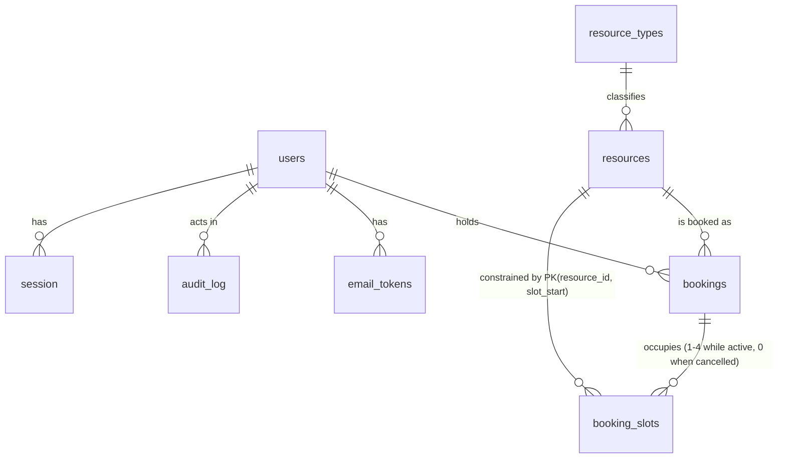

# Data Model

## Master Data vs. Transactional Data

A useful split for most business apps:

- **Master data** — relatively stable reference/core entities that other things point to.
  Changes rarely, usually via an admin flow. Examples: users, products, categories, accounts,
  price lists, org units.
- **Transactional data** — records of things that happened, usually time-stamped and
  append-heavy, referencing master data by ID. Examples: orders, payments, bookings, audit logs,
  sessions.

Why it matters for AI-assisted builds: master data usually needs full CRUD + validation +
admin UI; transactional data usually needs create + read + (rarely) reversal/correction, but
almost never update-in-place or delete — get this distinction into the spec and Claude won't
generate an "edit order" screen you didn't want, or skip audit trails on data that needed one.

**In this app:**

- **Master:** `users`, `resource_types`, `resources`.
- **Transactional:** `bookings`, `booking_slots`, `audit_log`, `email_tokens`, `session`.

There is deliberately **no "edit booking" flow**. A booking is created and cancelled, never
updated in place. Moving a booking means cancelling it and creating another — which keeps the
conflict check in exactly one code path.

## Entities

Timestamps are stored in UTC (see `CLAUDE.md` > Code Style); display conversion to
`Europe/Bucharest` is `ui-guidelines.md`'s problem. The one exception is `resources.open_time` /
`close_time`, which are `TIME` columns holding studio-local wall clock — a resource opens at 08:00
local regardless of the UTC offset that day. See `functional.md` > Slot generation & DST.

### users — Master

- **Purpose:** Every human account in the app. One table for both roles; an admin _is_ a member with
  extra rights, exactly as `functional.md` describes.
- **Key fields:**
  - `id` — `bigint` generated always as identity, PK
  - `email` — `citext NOT NULL UNIQUE` (case-insensitive; `ana@x.com` and `Ana@X.com` are one
    account). Requires the `citext` extension.
  - `password_hash` — `text NOT NULL` (bcrypt, cost factor in config)
  - `display_name` — `text NOT NULL`, 1–80 chars
  - `role` — `text NOT NULL DEFAULT 'member'`, `CHECK (role IN ('member','admin'))`
  - `status` — `text NOT NULL DEFAULT 'pending_verification'`,
    `CHECK (status IN ('pending_verification','active','deactivated'))`
  - `email_verified_at` — `timestamptz NULL`
  - `deactivated_at` — `timestamptz NULL`
  - `created_at`, `updated_at` — `timestamptz NOT NULL DEFAULT now()`
- **Relationships:** has many `bookings` (as the booking holder); has many `email_tokens`; has many
  `audit_log` rows (as actor); has many `session` rows.
- **Lifecycle:** Created by self-registration (`pending_verification`) or by `npm run seed:admin`
  (`active`, `role = 'admin'`, `email_verified_at` set). `display_name` and `password_hash` are
  editable by the owner; `role` and `status` only by an admin. **Never hard-deleted through the UI.**
  Deactivation is the exit path. GDPR erasure is a separate manual operation — see Data Retention.
- **Delete/cascade semantics:** No `ON DELETE CASCADE` from `bookings` to `users` — the FK is
  `ON DELETE RESTRICT`, so a user row cannot be removed while any booking references it. This is
  deliberate: it makes accidental mass deletion of booking history impossible, and forces GDPR
  erasure to go through the documented anonymisation path rather than a `DELETE`. `session` and
  `email_tokens` _do_ cascade — they're disposable.
- **Constraints / invariants:**
  - `email` unique, case-insensitively, across all statuses including deactivated.
  - At least one `active` user with `role = 'admin'` must exist at all times. Enforced in application
    code inside the transaction for demote and deactivate (a partial unique index can't express
    "at least one"), and covered by a test.
  - `status = 'active'` implies `email_verified_at IS NOT NULL` — except for seeded admins, which set
    both together.
- **Status change timestamps:** Yes — `email_verified_at` and `deactivated_at` are separate columns,
  not derivable from `status`. "Since when has this account been dormant" is a question the admin
  member list answers.

### resource_types — Master

- **Purpose:** The admin-managed vocabulary that drives the browse view's type filter. Chosen over a
  Postgres enum so the admin can add a type without a migration, and over free text so the filter
  doesn't fill with near-duplicates.
- **Key fields:**
  - `id` — `bigint` identity, PK
  - `name` — `citext NOT NULL UNIQUE`, 1–60 chars
  - `sort_order` — `integer NOT NULL DEFAULT 0` (controls filter and grid ordering)
  - `archived_at` — `timestamptz NULL`
  - `created_at`, `updated_at` — `timestamptz NOT NULL DEFAULT now()`
- **Relationships:** has many `resources`.
- **Lifecycle:** Created and edited by an admin. Archived, never deleted.
- **Delete/cascade semantics:** Archiving is **blocked** while any non-archived `resources` row
  points at it — same pattern as archiving a resource with live bookings. `DELETE` is not
  implemented; the FK from `resources` is `ON DELETE RESTRICT`.
- **Constraints / invariants:** `name` unique case-insensitively.
- **Seed values:** `[TODO]` — the initial list of types (e.g. Rehearsal Room, Desk, Equipment) wasn't
  decided. The seed script creates none by default; the admin adds them in Phase 2.

### resources — Master

- **Purpose:** A bookable thing in the studio.
- **Key fields:**
  - `id` — `bigint` identity, PK
  - `name` — `text NOT NULL`, 1–120 chars
  - `type_id` — `bigint NOT NULL REFERENCES resource_types(id) ON DELETE RESTRICT`
  - `description` — `text NOT NULL DEFAULT ''`
  - `capacity` — `integer NOT NULL CHECK (capacity >= 1)`
  - `open_time` — `time NOT NULL` (studio-local)
  - `close_time` — `time NOT NULL` (studio-local)
  - `archived_at` — `timestamptz NULL`
  - `created_at`, `updated_at` — `timestamptz NOT NULL DEFAULT now()`
- **Relationships:** belongs to `resource_types` (many-to-one); has many `bookings`; has many
  `booking_slots`.
- **Lifecycle:** Created and edited by an admin. Narrowing `open_time`/`close_time` triggers the
  warn-then-allow flow in `functional.md` > Edit a resource. Archived, never deleted.
- **Delete/cascade semantics:** Archiving is **blocked** while future active bookings exist —
  the admin must cancel them first, so no booking is ever silently destroyed. Past bookings keep
  pointing at archived resources indefinitely, which is why the row is never removed. The FK from
  `bookings` is `ON DELETE RESTRICT`.
- **Constraints / invariants:**
  - `close_time > open_time`. **Overnight windows are not supported** — a resource cannot open at
    22:00 and close at 02:00. If that's ever needed it's a schema change, not a config change.
    Flagged here because it's the kind of limit that only surfaces when someone tries it.
  - `capacity` is **descriptive only**. Nothing in the booking logic reads it. One active booking per
    resource per slot, enforced by `booking_slots`. Recorded explicitly so nobody later "fixes" the
    conflict check to respect it.
- **Status change timestamps:** `archived_at` only. Unarchiving clears it; the app does not keep a
  history of archive/unarchive cycles beyond the `audit_log`.

### bookings — Transactional

- **Purpose:** One member's claim on one resource for one contiguous time range. The unit a member
  sees and cancels.
- **Key fields:**
  - `id` — `bigint` identity, PK
  - `resource_id` — `bigint NOT NULL REFERENCES resources(id) ON DELETE RESTRICT`
  - `member_id` — `bigint NOT NULL REFERENCES users(id) ON DELETE RESTRICT`
  - `starts_at` — `timestamptz NOT NULL`
  - `ends_at` — `timestamptz NOT NULL`
  - `status` — `text NOT NULL DEFAULT 'booked'`, `CHECK (status IN ('booked','cancelled'))`
  - `cancelled_at` — `timestamptz NULL`
  - `cancelled_by` — `bigint NULL REFERENCES users(id) ON DELETE RESTRICT`
  - `created_at` — `timestamptz NOT NULL DEFAULT now()`
  - `UNIQUE (id, resource_id)` — not redundant; it's the target of `booking_slots`' composite FK
    below, which is what stops the two tables disagreeing about which resource a booking is on.
- **Relationships:** belongs to `resources`; belongs to `users` (the holder); has many
  `booking_slots` (exactly 1–4 while active, zero once cancelled).
- **Lifecycle:** Created by the holder (or by an admin for themselves). **Never updated in place**
  except for the cancellation fields. Never deleted by a user — only by the 12-month purge job.
- **Delete/cascade semantics:** `booking_slots` is `ON DELETE CASCADE` from `bookings`, which matters
  only for the purge job; normal cancellation deletes the slot rows explicitly. Nothing else points
  at a booking.
- **Constraints / invariants:**
  - `ends_at > starts_at`
  - Both endpoints align to a 30-minute boundary — `CHECK (date_part('minute', starts_at) IN (0,30)
AND date_part('second', starts_at) = 0)`, same for `ends_at`
  - Duration at most 2 hours — `CHECK (ends_at - starts_at <= interval '2 hours')`
  - `status = 'cancelled'` implies `cancelled_at IS NOT NULL AND cancelled_by IS NOT NULL`
  - The 3-active-bookings cap and the 30-day horizon are **application-level**, checked inside the
    booking transaction. They depend on `now()` and on a count across rows, so they can't be table
    constraints. Noted here so their absence from the schema reads as a decision, not an oversight.
- **Status change timestamps:** `created_at` and `cancelled_at`. No `booking_events` table — change
  history at the booking level was explicitly declined. See Change Auditing.

### booking_slots — Transactional

- **Purpose:** The concurrency control, expressed as data. One row per 30-minute slot a live booking
  occupies. **This table is the entire double-booking defence** — see
  `operations.md` > Concurrency & Write Correctness.
- **Key fields:**
  - `booking_id` — `bigint NOT NULL REFERENCES bookings(id) ON DELETE CASCADE`
  - `resource_id` — `bigint NOT NULL` (denormalised from the booking, so the unique index can exist)
  - `slot_start` — `timestamptz NOT NULL`
  - `PRIMARY KEY (resource_id, slot_start)` — the constraint that makes a double-booking impossible
  - `FOREIGN KEY (booking_id, resource_id) REFERENCES bookings(id, resource_id)` — the composite FK
    that keeps the denormalised `resource_id` honest
  - Index on `(booking_id)` for the cancellation delete
- **Relationships:** belongs to `bookings`.
- **Lifecycle:** Inserted in the same transaction as its booking. **Deleted when the booking is
  cancelled** — which is what frees the slot. Never updated.
- **Delete/cascade semantics:** Cascades from `bookings`. Deleting rows here is the normal, intended
  operation; the booking row survives as history.
- **Constraints / invariants:**
  - `slot_start` aligns to a 30-minute boundary.
  - A live booking has `(ends_at - starts_at) / 30 minutes` rows here; a cancelled one has zero.
    Enforced by the service layer and covered by a test, not by a constraint.
  - **Why a separate table rather than a `tstzrange` with a GiST exclusion constraint:** with fixed
    30-minute slots, a plain B-tree primary key gives the same guarantee, needs no extension, and
    produces an error (`23505`) that's trivial to map to a 409. The range approach is the right
    answer for free start/end times, which this app deliberately doesn't have.

### email_tokens — Transactional

- **Purpose:** Single-use tokens for email verification and password reset.
- **Key fields:**
  - `id` — `bigint` identity, PK
  - `user_id` — `bigint NOT NULL REFERENCES users(id) ON DELETE CASCADE`
  - `purpose` — `text NOT NULL`, `CHECK (purpose IN ('verify_email','reset_password'))`
  - `token_hash` — `text NOT NULL UNIQUE` — a SHA-256 of the token. **The raw token is never
    stored**, only emailed; a database leak must not hand over working reset links.
  - `expires_at` — `timestamptz NOT NULL`
  - `used_at` — `timestamptz NULL`
  - `created_at` — `timestamptz NOT NULL DEFAULT now()`
- **Relationships:** belongs to `users`.
- **Lifecycle:** Created on registration, resend, or reset request. Marked used on redemption. Rows
  older than 30 days are removed by the purge job.
- **Delete/cascade semantics:** Cascades with the user.
- **Constraints / invariants:** Issuing a new token for a `(user_id, purpose)` pair invalidates any
  outstanding one (set `used_at = now()` on the old rows in the same transaction), so only the most
  recent link works. Token lifetime: `[TODO]` — not decided. Needs a value per purpose before
  Phase 1.

### audit_log — Transactional

- **Purpose:** Security-relevant events. Deliberately **not** a booking history — it records auth
  events and admin actions on other people's data, which is what the interview asked for.
- **Key fields:**
  - `id` — `bigint` identity, PK
  - `occurred_at` — `timestamptz NOT NULL DEFAULT now()`
  - `actor_id` — `bigint NULL REFERENCES users(id) ON DELETE RESTRICT` (null for a failed login
    against an unknown email, and for the purge job)
  - `actor_email_attempted` — `text NULL` (for failed logins where no user matched)
  - `action` — `text NOT NULL` (e.g. `login.success`, `login.failure`, `admin.booking.cancel`,
    `admin.member.deactivate`, `admin.member.role_change`, `resource.create`, `resource.update`,
    `resource.archive`, `job.purge`)
  - `target_type` — `text NULL` (`booking`, `user`, `resource`, `resource_type`)
  - `target_id` — `bigint NULL`
  - `detail` — `jsonb NOT NULL DEFAULT '{}'` (small, structured; **never** a password, token, or
    session id)
  - `ip` — `inet NULL`
  - Index on `(occurred_at DESC)` and on `(target_type, target_id)`
- **Relationships:** references `users` as actor and, loosely, any entity as target.
- **Lifecycle:** Append-only. Never updated, never deleted through the app.
- **Delete/cascade semantics:** `ON DELETE RESTRICT` on `actor_id` — an audit row must not vanish
  because a user row did. GDPR erasure nulls `actor_id` and scrubs `detail` rather than deleting the
  row.
- **Constraints / invariants:** Written in the **same transaction** as the action it describes, so
  there is no such thing as an admin cancellation without its audit row.

### session — Transactional

- **Purpose:** Server-side sessions, managed by `connect-pg-simple`. Listed because it's a real table
  in the schema, not because the app writes it directly.
- **Key fields:** `sid` (PK), `sess` (`json`), `expire` (`timestamp`) — the library's own shape,
  created by its bundled DDL rather than by a hand-written migration.
- **Lifecycle:** Created on login, destroyed on logout, on deactivation (deleted by user id via a
  query against `sess`), and by expiry sweeping.
- **Delete/cascade semantics:** Freely deletable. No other table references it.

---

## Change Auditing

- Which entities need a full change history — who changed what, old value → new value, when — not
  just a current-state status field? **Bookings do not.** A `booking_events` table was considered and
  declined: the `bookings` row's `status` / `cancelled_at` / `cancelled_by` triple already answers
  "who cancelled this and when", which is the only booking question anyone asks here.
  - `users`, `resources` and `resource_types` get **event-level** auditing via `audit_log` — who did
    it, when, to what — but **not** old-value/new-value diffs. `detail` may carry the changed field
    names; it does not carry a full before/after snapshot.
- If any do, is that a dedicated audit-log entity or per-record versioning? A dedicated `audit_log`
  entity, queryable independently of the records it describes. No per-record versioning anywhere.

**Accepted limitation, stated so it reads as a decision:** you cannot reconstruct what a resource's
opening hours were three months ago. If that ever matters, it's a new table, not a retrofit of these
ones.

## Bulk Operations

> **Skip unless** this app imports records from a file or feed, or updates many records in one
> action. These questions have no cheap answer later — the mechanisms below are schema, not code.

**Gate does not fire.** No file imports, no feeds, no spreadsheet loading (an explicit non-goal), and
no bulk attribute updates. The nearest thing is deactivating a member, which cancels their future
bookings — a handful of rows inside one transaction, not a bulk operation needing a batch entity.
Section left unfilled deliberately.

## Relationships Overview

The one edge worth reading twice is `bookings → booking_slots`. Everything the app promises about
never double-booking lives in that relationship's primary key, not in application code.

## Data Retention / Archival

- **Bookings:** rows whose `ends_at` is more than **12 months** in the past are hard-deleted by
  `npm run purge:bookings`, run nightly by system cron (see `operations.md` > Background Jobs).
  Cascades remove any leftover `booking_slots` rows. One `audit_log` row per run records the count.
- **email_tokens:** rows older than 30 days are deleted by the same job. They're single-use and
  short-lived; keeping them serves nobody.
- **audit_log:** retention `[TODO]` — not decided. It currently grows without bound. At this scale
  that's harmless for years, but it holds IP addresses, which are personal data under GDPR, so it
  needs a number eventually. Flagged in `security.md` > Audit / Logging.
- **Deactivated users:** rows are kept indefinitely so booking history stays attributable. On a GDPR
  erasure request the admin runs a documented **anonymisation**, not a delete: `email` replaced with
  a non-routable unique placeholder (`deleted-<id>@invalid`), `display_name` set to `Deleted member`,
  `password_hash` scrambled, `audit_log.actor_id` nulled and `audit_log.ip` cleared for that user.
  Bookings survive with their `member_id` intact but no longer identify anyone.
  - `[TODO]` — whether this anonymisation is a script (`npm run erase:member -- <id>`) or an admin
    button. A script is the safer default for an irreversible operation, but it wasn't decided.
- **archived resources and resource types:** kept indefinitely. They're small, and deleting them
  would break historical bookings.
